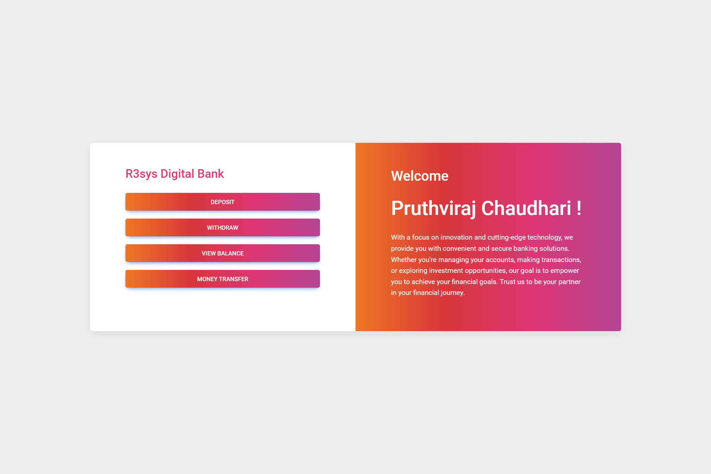
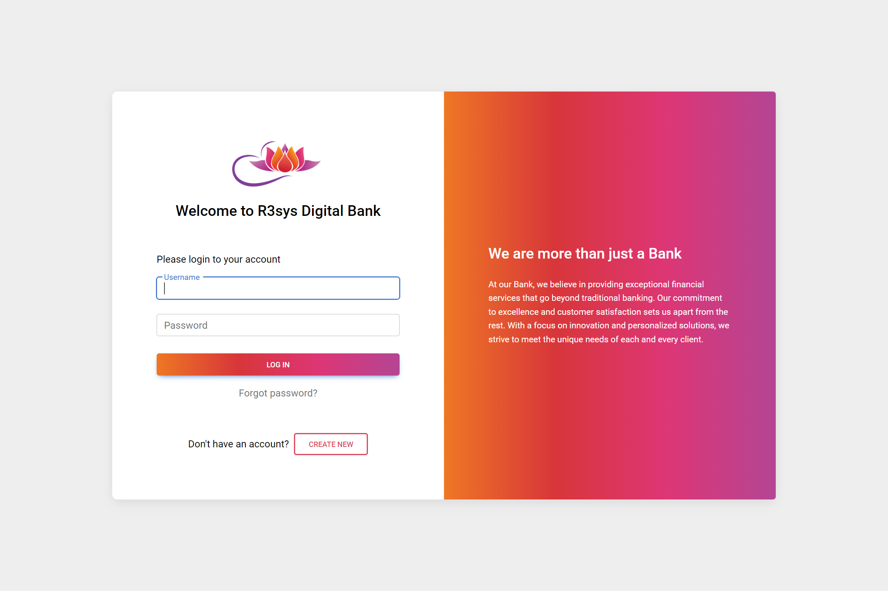
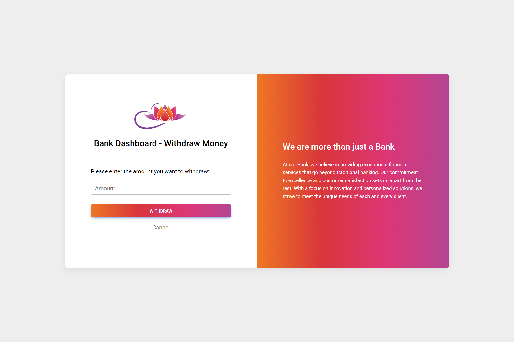
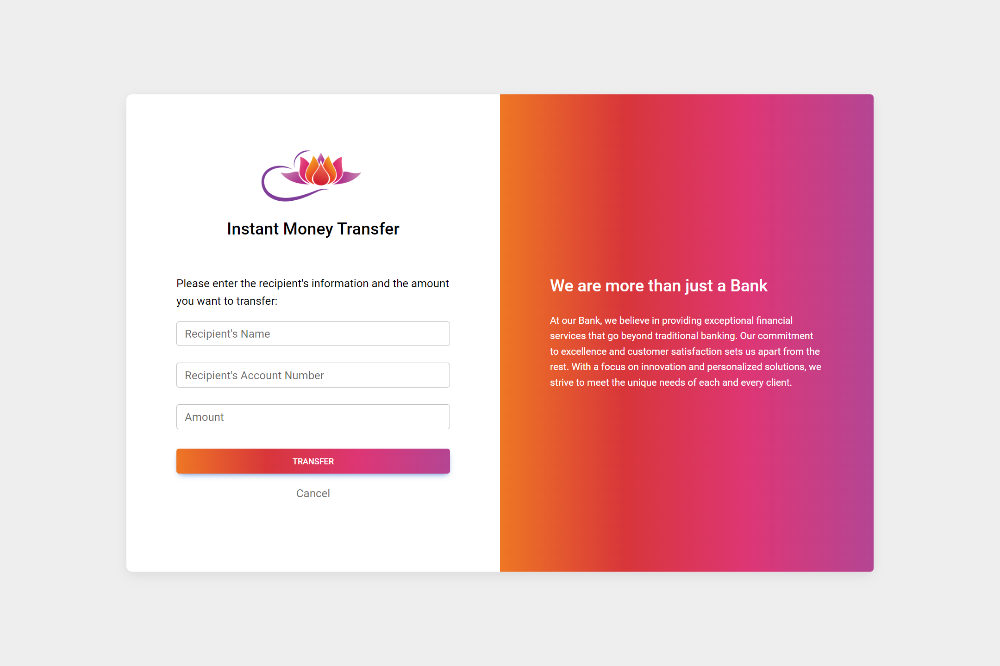

# R3sys Digital Banking Application

## Introduction

Welcome to the R3sys Digital Banking Application! This project was developed as a part of my Java training program with R3sys at R. C. Patel Institute of Technology, Shirpur. The application is designed to provide a seamless and user-friendly banking experience with various essential features.

## Features

- User login and signup functionality
- Account deposit and withdrawal
- View account balance
- Instant money transfer to other accounts
- Beautiful and intuitive user interface

## Technologies Used

- Java
- Servlets
- JSP (JavaServer Pages)
- JDBC (Java Database Connectivity)

## Database Structure

The application uses the MySQL database "bankdb" with the following tables:

### accounts

- accNo (Primary Key)
- cust_id (Foreign Key, References customers.id)
- accType
- balance

### customers

- id (Primary Key)
- name
- username
- password
- city
- mobile

## Sample Screenshots

## How to Use

1. Clone the repository to your local machine.
2. Set up the required database (MySQL, PostgreSQL, etc.) and update the database connection details in `DbConnection.java`.
3. Import the project into your favorite IDE (Eclipse, IntelliJ, etc.).
4. Run the application on a compatible server (Tomcat, Jetty, etc.).
5. Access the application using your browser at `http://localhost:<port>/R3sysDigitalBankingApp`.

## Contribution

This project was developed as a part of my Java training program. I am not actively maintaining it, but contributions are welcome. Feel free to fork the repository and submit pull requests for any improvements or bug fixes.

---

Thank you for checking out my project! If you have any questions or feedback, feel free to contact me.

Let's connect on LinkedIn: [Pruthviraj Chaudhari](http://linkedin.com/in/pruthviraj-chaudhari-8386ab230)

Happy coding! 🚀
